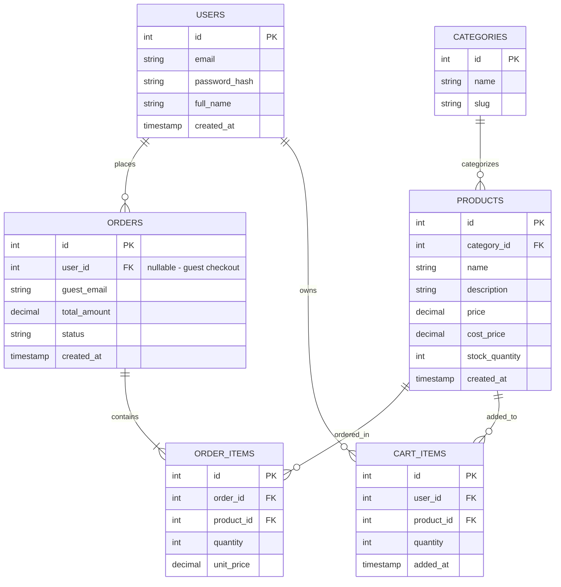

# Sprint 1: System Architecture & Scope Definition
## Kelvorne — Luxury Watch E-Commerce

## Section 1: Target Audience & Market Focus

- **Primary Persona:** Style-conscious buyers aged 20–35 looking for an affordable-luxury watch brand as a personal style statement or gift — not vintage collectors, so no complex variant modeling is needed.
- **Core Pain Point:** There is no dedicated online storefront for the Kelvorne brand — customers currently cannot browse the catalog, check stock, or track an order anywhere, since sales rely on informal channels with no structured purchase flow.
- **Domain Scope:** A single-brand luxury watch e-commerce store (Kelvorne) — not a multi-brand marketplace — covering the full catalog of Kelvorne watch models.

## Section 2: MVP Feature Scope

| Category | Feature Name | Description | Priority |
|---|---|---|---|
| Catalog | Product List & Search | Browse the Kelvorne watch catalog, filter by collection/model, keyword search. | High (MVP) |
| Cart | Cart Management | Persistent cart (guest session or logged-in user), add/update/remove items. | High (MVP) |
| Checkout | Order Processing | Guest or account checkout; mock payment gateway; creates Order + Order_Items. | High (MVP) |
| Accounts | Optional User Registration & Login | Optional account creation/login (JWT via Supabase Auth) for saved orders and faster checkout. | Medium |
| Admin | Order & Customer Management | Admin view of all orders, order status updates, and customer contact/order info. | High (MVP) |
| Admin | Inventory Control | Admin CRUD for watch models (name, price, cost, stock, images, collection). | High (MVP) |
| Admin | Sales & Revenue Dashboard | Admin view of total sales, revenue, and profit (revenue − cost price) per product/period. | Medium |

## Section 3: Tech Stack Selection & Justification

- **Frontend Framework: Next.js + React Three Fiber**
  Justification: Next.js provides better image optimization and SEO than a plain SPA, which matters for a real storefront. React Three Fiber (a React wrapper for Three.js) is the standard way to render an interactive 3D watch viewer without hand-writing raw WebGL.

- **Backend / Database / Auth / Realtime: Supabase (PostgreSQL)**
  Justification: Supabase bundles a managed PostgreSQL database, authentication, realtime subscriptions, and file storage into one platform. Because it is real PostgreSQL underneath, the relational ERD below (with explicit PKs, FKs, and cardinality) remains fully valid — unlike a NoSQL alternative such as Firebase, which would require restructuring the schema as documents and would weaken the ERD's alignment with the grading rubric.

- **Hosting: Vercel (frontend) + Supabase Cloud (backend/database)**
  Justification: Vercel is built for Next.js deployment with minimal configuration, and Supabase Cloud hosts the database, auth, and storage together, avoiding the need to separately provision and manage backend infrastructure for a solo, semester-length project.

- **Caching & Asynchronous Processing (Optional): Not used for MVP**
  Justification: Supabase's built-in realtime and caching are sufficient at this scale; a separate caching layer (e.g. Redis) is not required for the MVP feature set.

## Section 4: Entity-Relationship Diagram (ERD)

**Relationship & cardinality notes:**
- `USERS (1) --- (N) ORDERS`: one user can place many orders; an order may also have no user (guest checkout), in which case `guest_email` is used for contact and confirmation.
- `ORDERS (1) --- (N) ORDER_ITEMS`: one order contains multiple order items; each order item belongs to exactly one order.
- `PRODUCTS (1) --- (N) ORDER_ITEMS`: one product can appear in many order items; each order item references exactly one product. `ORDERS` and `PRODUCTS` therefore have an N:M relationship resolved through the `ORDER_ITEMS` associative entity.
- `CATEGORIES (1) --- (N) PRODUCTS`: one category groups many products; each product belongs to exactly one category.
- `USERS (1) --- (N) CART_ITEMS` and `PRODUCTS (1) --- (N) CART_ITEMS`: the cart is modeled as per-user cart items rather than a separate `CART` entity, since each user has exactly one active cart — this resolves the N:M relationship between users and products in the cart without an unnecessary 1:1 `USERS`–`CART` table.
- `PRODUCTS.cost_price` (distinct from `price`) supports the Admin Sales & Revenue Dashboard's profit calculation (`price − cost_price`) per unit sold.
