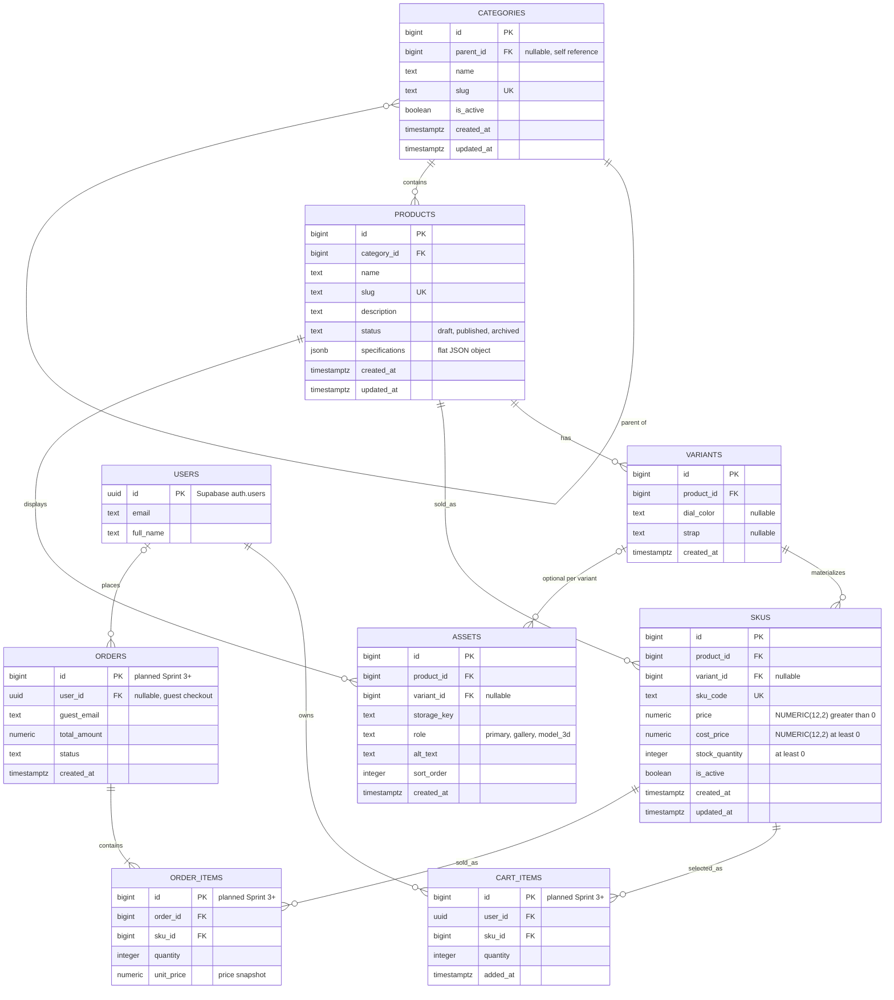

# Sprint 2: Catalog Data Foundation
## Kelvorne — Luxury Watch E-Commerce

> Builds on [`SPRINT_1.md`](./SPRINT_1.md). Code lives in [`backend/`](../backend).

---

## 1. Sprint goal and scope boundary

**Goal:** a catalog administrator can persist **categories, products, variants and SKUs** of Kelvorne watches without losing identity, relationship, price, cost or inventory meaning. The database itself (not only the API) protects uniqueness, relationships, money and stock.

**In scope (delivered):**
- Category tree (collection → watch line) with stable ids, unique slugs, parent/child links and cycle prevention (CAT01).
- Product create/edit with name, slug, description, status and one canonical category (CAT02).
- Variants (valid dial/strap combinations) and SKUs (unique code, own price, own cost, own stock, active flag) (CAT03, CAT04).
- Database constraints, triggers, migration, seed data and automated tests (CAT05).
- Authenticated administrator-only routes under `/api/v1/admin` (CAT06). This is the Sprint 1 *Inventory Control* feature.

**Out of scope (NOT claimed as Sprint 2 functionality):**
dynamic specification management screens, asset upload (the `assets` table exists as schema only), public catalog search, publication workflow beyond "published needs an active SKU", payment gateway, order placement, shipping, the shopper checkout flow, and the Sprint 1 admin features *Order & Customer Management* and *Sales & Revenue Dashboard* (only the `cost_price` data they need is prepared). Carts and orders are **planned connections only**.

---

## 2. Link to Sprint 1 decisions (reused / changed)

| Sprint 1 decision | Sprint 2 status | Notes |
|---|---|---|
| Domain: single-brand luxury watch store (Kelvorne), buyers 20–35 | **Reused** | Seed data is Kelvorne watch collections and models. |
| Stack: PostgreSQL via Supabase, Supabase Auth (JWT) | **Reused** | Migrations are plain SQL in `backend/supabase/migrations`. Admin identity comes from the Supabase JWT (`app_metadata.role = "admin"`). |
| Frontend: Next.js + React Three Fiber | **Reused (data only)** | No UI in Sprint 2. The API core is framework-agnostic and ships a ready Next.js route adapter (`backend/next-route.example.js`); locally it runs as a plain Node server. The 3D watch viewer gets its model file through `ASSETS` (role `model_3d`). |
| Hosting: Vercel + Supabase Cloud | **Reused** | Sprint 2 is demonstrated locally against Supabase; Vercel deployment is optional. |
| "No complex variant modeling needed" (buyers are not collectors) | **Reused** | Variants are deliberately minimal: only **dial colour** and **strap**. Case size, movement, etc. are product specifications. |
| `PRODUCTS.price`, `PRODUCTS.cost_price`, `PRODUCTS.stock_quantity` | **Moved to SKUS** | Sprint 2 requires Product → Variant → SKU with price and stock on the sellable unit. `cost_price` moves with them so the Sprint 1 profit dashboard (`price − cost_price`) stays possible per SKU. |
| `CATEGORIES(id, name, slug)` | **Extended** | Adds `parent_id`, `is_active`, timestamps (collection → line tree for the "filter by collection/model" feature). |
| Admin CRUD of "name, price, cost, stock, images, collection" | **Split** | Name/collection → `products`; price/cost/stock → `skus`; images → `assets` (Sprint 1 had no image field in the ERD). |
| `CART_ITEMS.product_id`, `ORDER_ITEMS.product_id` | **Re-pointed (planned)** | They will reference `SKUS.id` (`sku_id`) because the shopper buys a specific dial/strap combination. Not implemented in Sprint 2. |
| Cart modeled as per-user `CART_ITEMS` (no `CART` table) | **Reused** | Kept as is; there is no `CARTS` entity in Kelvorne. |
| Guest cart (session) in scope, but `CART_ITEMS.user_id` only | **Gap noted** | A nullable `user_id` plus a `session_id` is needed for guest carts → Sprint 3 backlog. |
| `USERS.password_hash` | **Clarified** | Passwords are handled entirely by Supabase Auth (`auth.users`); the app never stores hashes. |
| Guest checkout (`ORDERS.user_id` nullable, `guest_email`) | **Reused (planned)** | Unchanged; orders arrive in Sprint 3+. |

---

## 3. Updated ERD and data dictionary

Entities marked *(planned, Sprint 3+)* are **not created** in Sprint 2; they are shown to prove how the catalog connects to the Sprint 1 cart/order model.



> The manual's sample diagram links `CART_ITEMS` to PRODUCTS; here it links to **SKUS** because the item a shopper selects is a specific dial/strap combination. The product is always reachable through `skus.product_id`. There is no `CARTS` table because Sprint 1 models the cart as per-user `CART_ITEMS`.

### Cardinality and delete/update policy of every foreign key

| Relationship | Cardinality | FK | ON DELETE | ON UPDATE | Why |
|---|---|---|---|---|---|
| Category → Category | 1 : 0..N (tree) | `categories.parent_id` | RESTRICT | CASCADE | A category with children cannot be deleted; deactivate instead. |
| Category → Product | 1 : 0..N | `products.category_id` | RESTRICT | CASCADE | A collection/line that still has watches cannot be removed. |
| Product → Variant | 1 : 0..N | `variants.product_id` | CASCADE | CASCADE | Variants have no meaning without their product (only draft products are hard-deleted). |
| Product → SKU | 1 : 1..N when published, 0..N when draft | `skus.product_id` | CASCADE | CASCADE | Same as above. |
| Variant → SKU | 1 : 0..N | `(skus.variant_id, skus.product_id)` → `variants(id, product_id)` | NO ACTION | CASCADE | Composite key guarantees a SKU's variant belongs to the **same product**. NULL `variant_id` = default SKU of a watch with no variants. |
| Product → Asset | 1 : 0..N | `assets.product_id` | CASCADE | CASCADE | Images and the 3D model belong to the watch. |
| Variant → Asset | 1 : 0..N (optional) | `(assets.variant_id, assets.product_id)` | NO ACTION | CASCADE | Optional per-variant image (e.g. a dial photo). |
| User → Cart_Item *(planned)* | 1 : 0..N | `cart_items.user_id` | CASCADE | CASCADE | Per-user cart as in Sprint 1. |
| SKU → Cart_Item *(planned)* | 1 : 0..N | `cart_items.sku_id` | RESTRICT | CASCADE | A SKU in a cart cannot be hard-deleted; deactivate it. |
| User → Order *(planned)* | 1 : 0..N (optional, guest orders) | `orders.user_id` | SET NULL | CASCADE | Guest checkout and order history survive account removal. |
| Order → Order_Item *(planned)* | 1 : 1..N | `order_items.order_id` | CASCADE | CASCADE | |
| SKU → Order_Item *(planned)* | 1 : 0..N | `order_items.sku_id` | RESTRICT | CASCADE | Sold SKUs are never deleted, order history stays intact. |

### Data dictionary (implemented tables)

**categories**

| Column | Type | Constraints |
|---|---|---|
| id | bigint identity | PK |
| parent_id | bigint | FK → categories.id, nullable; `CHECK parent_id <> id` |
| name | text | NOT NULL, not blank |
| slug | text | NOT NULL, UNIQUE, `^[a-z0-9]+(-[a-z0-9]+)*$` |
| is_active | boolean | NOT NULL, default true |
| created_at / updated_at | timestamptz | NOT NULL, default now() (updated_at maintained by trigger) |

**products**

| Column | Type | Constraints |
|---|---|---|
| id | bigint identity | PK |
| category_id | bigint | FK → categories.id, NOT NULL |
| name | text | NOT NULL, not blank |
| slug | text | NOT NULL, UNIQUE, slug format |
| description | text | NOT NULL, default '' |
| status | text | NOT NULL, default `draft`, `CHECK IN (draft, published, archived)` |
| specifications | jsonb | NOT NULL, default `{}`, `CHECK jsonb_typeof = 'object'` |
| created_at / updated_at | timestamptz | as above |

**variants**

| Column | Type | Constraints |
|---|---|---|
| id | bigint identity | PK; `UNIQUE (id, product_id)` (target of composite FKs) |
| product_id | bigint | FK → products.id, NOT NULL |
| dial_color, strap | text | nullable, but at least one must be set |
| — | — | `UNIQUE NULLS NOT DISTINCT (product_id, dial_color, strap)`: a combination exists once |

**skus**

| Column | Type | Constraints |
|---|---|---|
| id | bigint identity | PK |
| product_id | bigint | FK → products.id, NOT NULL |
| variant_id | bigint | nullable; composite FK with product_id |
| sku_code | text | NOT NULL, **UNIQUE**, `^[A-Z0-9]+(-[A-Z0-9]+)*$` |
| price | numeric(12,2) | NOT NULL, `CHECK price > 0` (no floating point) |
| cost_price | numeric(12,2) | NOT NULL, `CHECK cost_price >= 0` |
| stock_quantity | integer | NOT NULL, default 0, `CHECK stock_quantity >= 0` |
| is_active | boolean | NOT NULL, default true |
| created_at / updated_at | timestamptz | as above |
| — | — | partial unique index: one variant-less (default) SKU per product |

**assets** (schema only): id, product_id, variant_id, storage_key, role (`primary|gallery|model_3d`), alt_text, sort_order, created_at.

### Specification validation rule (Specification entity)

Specifications (movement, case size, water resistance, glass…) are stored as **validated JSONB on `products.specifications`**. Sprint 1 uses a relational model without EAV tables, and a watch's specs are descriptive attributes that are not used in joins, so JSONB keeps the schema simple. The rule is enforced in the database (`CHECK jsonb_typeof(specifications) = 'object'`) and in the API validator:

1. Must be a **flat JSON object** (no arrays, no nesting, no `null` values).
2. At most **20 keys**; each key is `snake_case` (`a-z`, `0-9`, `_`, 1–50 chars).
3. Each value is a **string (≤ 200 chars), a finite number, or a boolean**.

Example valid value: `{"movement": "automatic", "case_mm": 40, "water_resistance_m": 50}`. Example rejected: `{"nested": {"a": 1}}`.

### Database-level business rules (triggers)

| Rule | Mechanism | API error |
|---|---|---|
| A category cannot become its own ancestor | trigger `categories_check_cycle` walks the parent chain (+ `CHECK parent_id <> id`) | 422 `CATEGORY_CYCLE` |
| Deactivating a parent deactivates its whole subtree | trigger `categories_cascade_deactivate` | — |
| An inactive parent cannot have an active child | trigger `categories_parent_active` | 422 `PARENT_INACTIVE` |
| A published product always has at least one active SKU | triggers `products_publish_rule`, `skus_keep_sellable_*` | 422 `NOT_SELLABLE` |
| Variants and variant-less SKUs are never mixed on one product | triggers `skus_variant_rule`, `variants_rule` | 422 `VARIANT_MISMATCH` |

---

## 4. Administration route table

Base path: `/api/v1/admin`. **Every route requires** `Authorization: Bearer <Supabase access token>` of a user with `app_metadata.role = "admin"`.

| Method | Route | Purpose | Success |
|---|---|---|---|
| POST | `/categories` | Create a category | 201 |
| GET | `/categories` | Return the category tree | 200 |
| PATCH | `/categories/:id` | Update / move / deactivate a category | 200 |
| POST | `/products` | Create a **draft** product | 201 |
| GET | `/products` | List products with variants and SKUs (`?status=&category_id=&limit=&offset=`) | 200 |
| GET | `/products/:id` | One product with variants and SKUs | 200 |
| PATCH | `/products/:id` | Update content, category, status | 200 |
| DELETE | `/products/:id` | Hard-delete a **draft** product only | 200 |
| POST | `/products/:id/variants` | Add a valid dial/strap combination | 201 |
| POST | `/products/:id/skus` | Add a validated SKU | 201 |
| PATCH | `/skus/:id` | Update price, cost, stock or active status | 200 |
| DELETE | `/skus/:id` | Delete a SKU (blocked for the last active SKU of a published product) | 200 |

The seven routes required by the manual are `POST/GET/PATCH products`, `POST products/:id/skus`, `PATCH skus/:id`, `POST/GET categories`; the others are additions needed for CAT01 (update/deactivate), variants (CAT03/04) and CRUD completeness.

### Request fields

| Route | Body fields |
|---|---|
| POST /categories | `name`* string, `slug`* slug, `parent_id` id\|null, `is_active` bool |
| PATCH /categories/:id | any of `name`, `slug`, `parent_id`, `is_active` (at least one) |
| POST /products | `category_id`* id, `name`* string, `slug`* slug, `description` text, `specifications` object, `status` (only `"draft"`) |
| PATCH /products/:id | any of `category_id`, `name`, `slug`, `description`, `status` (`draft/published/archived`), `specifications` |
| POST /products/:id/variants | `dial_color`, `strap` (at least one) |
| POST /products/:id/skus | `sku_code`* UPPERCASE-with-hyphens, `price`* (> 0), `cost_price`* (≥ 0), `variant_id` id\|null, `stock_quantity` int ≥ 0, `is_active` bool. Money: number or string, max 2 decimals |
| PATCH /skus/:id | any of `price`, `cost_price`, `stock_quantity`, `is_active` |

`*` = required. Unknown fields are rejected.

### Status codes and one consistent error shape

| Status | Meaning | Example `error.code` |
|---|---|---|
| 200 / 201 | Success | — |
| 400 | Validation error (bad/missing fields, malformed id, invalid JSON) | `VALIDATION_ERROR`, `INVALID_JSON` |
| 401 | Missing, malformed or invalid token | `UNAUTHENTICATED` |
| 403 | Logged in but not an administrator | `FORBIDDEN` |
| 404 | Unknown route or record | `NOT_FOUND` |
| 405 | Wrong method for an existing route | `METHOD_NOT_ALLOWED` |
| 409 | Duplicate or in-use conflict | `DUPLICATE_SLUG`, `DUPLICATE_SKU_CODE`, `DUPLICATE_VARIANT`, `PRODUCT_NOT_DRAFT`, `IN_USE` |
| 422 | Valid syntax but breaks a business rule | `CATEGORY_CYCLE`, `PARENT_INACTIVE`, `NOT_SELLABLE`, `VARIANT_MISMATCH`, `INVALID_REFERENCE`, `NEGATIVE_STOCK`, `INVALID_COST` |
| 500 | Unexpected error (logged server-side, generic message to the client, never a traceback) | `INTERNAL_ERROR` |

```json
{ "error": { "code": "DUPLICATE_SKU_CODE", "message": "A SKU with this code already exists" } }
```

Validation errors add a `details` array: `[{ "field": "stock_quantity", "message": "must be a non-negative integer" }]`.

### Examples

**Create a category** — `POST /api/v1/admin/categories`
```json
{ "name": "Minimalist", "slug": "minimalist", "parent_id": 1 }
```
`201`
```json
{ "data": { "id": 7, "parent_id": 1, "name": "Minimalist", "slug": "minimalist", "is_active": true,
            "created_at": "2026-10-01T19:29:46.718Z", "updated_at": "2026-10-01T19:29:46.718Z" } }
```

**Create a draft product** — `POST /api/v1/admin/products`
```json
{ "name": "Slim Quartz", "slug": "slim-quartz", "category_id": 7, "description": "Thin quartz watch" }
```
`201` → `{ "data": { "id": 5, "category_id": 7, "slug": "slim-quartz", "status": "draft", "specifications": {}, "variants": [], "skus": [], ... } }`

**Add a variant** — `POST /api/v1/admin/products/5/variants`
```json
{ "dial_color": "White", "strap": "Leather" }
```
`201` → `{ "data": { "id": 6, "product_id": 5, "dial_color": "White", "strap": "Leather", ... } }`

**Add a SKU** — `POST /api/v1/admin/products/5/skus`
```json
{ "sku_code": "KLV-SLM-WHT-LTH", "variant_id": 6, "price": "24900.00", "cost_price": "14500.00", "stock_quantity": 10 }
```
`201`
```json
{ "data": { "id": 7, "product_id": 5, "variant_id": 6, "sku_code": "KLV-SLM-WHT-LTH", "price": "24900.00",
            "cost_price": "14500.00", "stock_quantity": 10, "is_active": true, "availability": "in_stock", ... } }
```

**Duplicate SKU** — same request again → `409` `DUPLICATE_SKU_CODE` (shape above).

**Negative stock** — `PATCH /api/v1/admin/skus/1` with `{ "stock_quantity": -3 }` → `400` `VALIDATION_ERROR` with `details[0].field = "stock_quantity"`. Even if the API check were bypassed, PostgreSQL rejects it with `CHECK (stock_quantity >= 0)`.

**No token** — `GET /api/v1/admin/categories` → `401`
```json
{ "error": { "code": "UNAUTHENTICATED", "message": "Missing or malformed Authorization header" } }
```

---

## 5. Data integrity and authorization decisions

**Integrity (CAT05).** Every rule is enforced by PostgreSQL; the API only translates errors into clean 4xx responses:
- Unique: `categories.slug`, `products.slug`, `skus.sku_code`, variant combination, one default SKU per product.
- Foreign keys with explicit `ON DELETE / ON UPDATE` policies (table above); a composite FK keeps SKU and variant on the same product.
- Money (`price`, `cost_price`) is `NUMERIC(12,2)` and returned to clients **as a string** (`"48500.00"`), so it never passes through a floating-point number.
- Stock: `CHECK (stock_quantity >= 0)` plus API validation. Price must be > 0 and cost ≥ 0.
- Triggers for tree cycles, parent/child activation, the publish rule and variant/SKU mixing.

**Authorization (CAT06).**
- Authentication: the access token is verified by asking Supabase Auth (`/auth/v1/user`) who it belongs to.
- Authorization: only users whose Supabase **`app_metadata.role` is `admin`** pass. `app_metadata` can only be changed server-side (not by the user), unlike `user_metadata`. This keeps normal shoppers (Sprint 1's optional accounts) out of the admin API.
- Order of checks: route matched → **401/403 decided before any database access** → validation → database.
- Defence in depth: Row Level Security is enabled on all catalog tables with a single policy allowing only admin JWTs, so even direct Supabase client access cannot write as a normal user. The backend connects with the table-owner role, which bypasses RLS by design.
- No secrets in the repository: `.env` is git-ignored; `.env.example` has placeholders. The `service_role` key is **not used**.

---

## 6. Seed data and demonstration

### Reproducible seed (`backend/supabase/seed.sql`)

`npm run seed` wipes the catalog tables and recreates identical data on any clean database:

| Item | Seeded |
|---|---|
| Category tree (2 levels) | Heritage → Automatic, Dress; Sport → Chronograph, Diver |
| Products | Aurora Automatic (3 variants), Meridian Chronograph (2 variants), Solstice Slim (no variants, one default SKU), Eclipse Diver (draft, no SKU) |
| SKUs (6), price / cost / stock | `KLV-AUR-BLK-STL` 48500 / 29000 / 8, `KLV-AUR-BLK-LTH` 45500 / 27000 / 5, `KLV-AUR-SLV-STL` 48500 / 29000 / **0**, `KLV-MER-BLU-RBR` 36500 / 21000 / 12, `KLV-MER-GRN-RBR` 36500 / 21000 / 7, `KLV-SOL-STD` 29900 / 17500 / 15 |
| Intentionally unavailable combination | Aurora **Silver dial / Leather strap** is not produced → no variant row and no SKU (not a fake zero-stock SKU) |
| Out-of-stock SKU | `KLV-AUR-SLV-STL` (active, stock 0) |

### Demonstration steps

```powershell
cd backend
npm install
Copy-Item .env.example .env   # fill in your Supabase values (never commit .env)
npm run migrate               # creates tables, triggers, RLS
npm run seed                  # loads the demo catalog
npm run dev                   # Terminal 1: API on http://localhost:3000 (keep open)
```

Make a Supabase user an administrator (SQL Editor, once):

```sql
update auth.users
set raw_app_meta_data = coalesce(raw_app_meta_data, '{}'::jsonb) || '{"role":"admin"}'
where email = 'admin@kelvorne.test';
```

Then, in a second terminal (inside `backend/`):

```powershell
npm run evidence
```

`scripts/evidence.mjs` signs in as the administrator through Supabase Auth, performs the 18 calls below against the running API, redacts the bearer token and the Supabase URL, and writes the raw output to `docs/EVIDENCE_OUTPUT.md`. The administrator creates a category, a child category, a product, a variant and a SKU (E1 to E6), updates and publishes it (E7, E8), and retrieves the records through the administration API (E9 to E11). E12 to E18 are the rejection paths.

### Request/response evidence

Captured on 2026-10-02 against the team's Supabase project, from the script above. Tokens and private URLs are redacted. Ids in the section 4 examples come from a fresh seed; the ids below (45, 60, ...) are from the live run, which continues after earlier test runs.

#### Core flow

##### E1. Create parent category

```http
POST /api/v1/admin/categories
Authorization: Bearer <REDACTED>
Content-Type: application/json

{
  "name": "Demo Collection",
  "slug": "demo-collection-muqvp3ti"
}
```

Response: **201**

```json
{
  "data": {
    "id": 45,
    "parent_id": null,
    "name": "Demo Collection",
    "slug": "demo-collection-muqvp3ti",
    "is_active": true,
    "created_at": "2026-10-02T11:27:19.794Z",
    "updated_at": "2026-10-02T11:27:19.794Z"
  }
}
```

##### E2. Create child category (2-level tree)

```http
POST /api/v1/admin/categories
Authorization: Bearer <REDACTED>
Content-Type: application/json

{
  "name": "Demo Line",
  "slug": "demo-line-muqvp3ti",
  "parent_id": 45
}
```

Response: **201**

```json
{
  "data": {
    "id": 46,
    "parent_id": 45,
    "name": "Demo Line",
    "slug": "demo-line-muqvp3ti",
    "is_active": true,
    "created_at": "2026-10-02T11:27:20.346Z",
    "updated_at": "2026-10-02T11:27:20.346Z"
  }
}
```

##### E3. Create product (always starts as draft)

```http
POST /api/v1/admin/products
Authorization: Bearer <REDACTED>
Content-Type: application/json

{
  "name": "Demo Watch",
  "slug": "demo-watch-muqvp3ti",
  "category_id": 46,
  "description": "Evidence demo watch",
  "specifications": {
    "movement": "quartz",
    "case_mm": 40
  }
}
```

Response: **201**

```json
{
  "data": {
    "id": 60,
    "category_id": 46,
    "name": "Demo Watch",
    "slug": "demo-watch-muqvp3ti",
    "description": "Evidence demo watch",
    "status": "draft",
    "specifications": {
      "case_mm": 40,
      "movement": "quartz"
    },
    "created_at": "2026-10-02T11:27:20.649Z",
    "updated_at": "2026-10-02T11:27:20.649Z",
    "variants": [],
    "skus": []
  }
}
```

##### E4. Publishing without an active SKU is refused

```http
PATCH /api/v1/admin/products/60
Authorization: Bearer <REDACTED>
Content-Type: application/json

{
  "status": "published"
}
```

Response: **422**

```json
{
  "error": {
    "code": "NOT_SELLABLE",
    "message": "A published product needs at least one active SKU"
  }
}
```

##### E5. Create variant (valid combination)

```http
POST /api/v1/admin/products/60/variants
Authorization: Bearer <REDACTED>
Content-Type: application/json

{
  "dial_color": "White",
  "strap": "Leather"
}
```

Response: **201**

```json
{
  "data": {
    "id": 33,
    "product_id": 60,
    "dial_color": "White",
    "strap": "Leather",
    "created_at": "2026-10-02T11:27:21.648Z"
  }
}
```

##### E6. Create SKU

```http
POST /api/v1/admin/products/60/skus
Authorization: Bearer <REDACTED>
Content-Type: application/json

{
  "sku_code": "DEMO-MUQVP3TI-WHT-LTH",
  "variant_id": 33,
  "price": "24900.00",
  "cost_price": "14500.00",
  "stock_quantity": 10
}
```

Response: **201**

```json
{
  "data": {
    "id": 46,
    "product_id": 60,
    "variant_id": 33,
    "sku_code": "DEMO-MUQVP3TI-WHT-LTH",
    "price": "24900.00",
    "cost_price": "14500.00",
    "stock_quantity": 10,
    "is_active": true,
    "created_at": "2026-10-02T11:27:22.039Z",
    "updated_at": "2026-10-02T11:27:22.039Z",
    "availability": "in_stock"
  }
}
```

##### E7. Update SKU price and stock

```http
PATCH /api/v1/admin/skus/46
Authorization: Bearer <REDACTED>
Content-Type: application/json

{
  "price": "25900.00",
  "stock_quantity": 12
}
```

Response: **200**

```json
{
  "data": {
    "id": 46,
    "product_id": 60,
    "variant_id": 33,
    "sku_code": "DEMO-MUQVP3TI-WHT-LTH",
    "price": "25900.00",
    "cost_price": "14500.00",
    "stock_quantity": 12,
    "is_active": true,
    "created_at": "2026-10-02T11:27:22.039Z",
    "updated_at": "2026-10-02T11:27:22.264Z",
    "availability": "in_stock"
  }
}
```

##### E8. Publish product (now has a sellable SKU)

```http
PATCH /api/v1/admin/products/60
Authorization: Bearer <REDACTED>
Content-Type: application/json

{
  "status": "published"
}
```

Response: **200**

```json
{
  "data": {
    "id": 60,
    "category_id": 46,
    "name": "Demo Watch",
    "slug": "demo-watch-muqvp3ti",
    "description": "Evidence demo watch",
    "status": "published",
    "specifications": {
      "case_mm": 40,
      "movement": "quartz"
    },
    "created_at": "2026-10-02T11:27:20.649Z",
    "updated_at": "2026-10-02T11:27:22.478Z",
    "variants": [
      {
        "id": 33,
        "dial_color": "White",
        "strap": "Leather"
      }
    ],
    "skus": [
      {
        "id": 46,
        "variant_id": 33,
        "sku_code": "DEMO-MUQVP3TI-WHT-LTH",
        "price": "25900.00",
        "cost_price": "14500.00",
        "stock_quantity": 12,
        "is_active": true,
        "availability": "in_stock"
      }
    ]
  }
}
```

##### E9. Read one product with variants and SKUs

```http
GET /api/v1/admin/products/60
Authorization: Bearer <REDACTED>
```

Response: **200**

```json
{
  "data": {
    "id": 60,
    "category_id": 46,
    "name": "Demo Watch",
    "slug": "demo-watch-muqvp3ti",
    "description": "Evidence demo watch",
    "status": "published",
    "specifications": {
      "case_mm": 40,
      "movement": "quartz"
    },
    "created_at": "2026-10-02T11:27:20.649Z",
    "updated_at": "2026-10-02T11:27:22.478Z",
    "variants": [
      {
        "id": 33,
        "dial_color": "White",
        "strap": "Leather"
      }
    ],
    "skus": [
      {
        "id": 46,
        "variant_id": 33,
        "sku_code": "DEMO-MUQVP3TI-WHT-LTH",
        "price": "25900.00",
        "cost_price": "14500.00",
        "stock_quantity": 12,
        "is_active": true,
        "availability": "in_stock"
      }
    ]
  }
}
```

##### E10. List products

```http
GET /api/v1/admin/products?limit=3
Authorization: Bearer <REDACTED>
```

Response: **200**

<details>
<summary>Show full response</summary>

```json
{
  "data": [
    {
      "id": 1,
      "category_id": 3,
      "name": "Aurora Automatic",
      "slug": "aurora-automatic",
      "description": "Self-winding automatic watch with a sunburst dial.",
      "status": "published",
      "specifications": {
        "glass": "sapphire",
        "case_mm": 40,
        "movement": "automatic",
        "water_resistance_m": 50
      },
      "created_at": "2026-10-01T21:10:35.589Z",
      "updated_at": "2026-10-01T21:10:35.589Z",
      "variants": [
        {
          "id": 1,
          "dial_color": "Black",
          "strap": "Steel"
        },
        {
          "id": 2,
          "dial_color": "Black",
          "strap": "Leather"
        },
        {
          "id": 3,
          "dial_color": "Silver",
          "strap": "Steel"
        }
      ],
      "skus": [
        {
          "id": 1,
          "variant_id": 1,
          "sku_code": "KLV-AUR-BLK-STL",
          "price": "48500.00",
          "cost_price": "29000.00",
          "stock_quantity": 8,
          "is_active": true,
          "availability": "in_stock"
        },
        {
          "id": 2,
          "variant_id": 2,
          "sku_code": "KLV-AUR-BLK-LTH",
          "price": "45500.00",
          "cost_price": "27000.00",
          "stock_quantity": 5,
          "is_active": true,
          "availability": "in_stock"
        },
        {
          "id": 3,
          "variant_id": 3,
          "sku_code": "KLV-AUR-SLV-STL",
          "price": "48500.00",
          "cost_price": "29000.00",
          "stock_quantity": 0,
          "is_active": true,
          "availability": "out_of_stock"
        }
      ]
    },
    {
      "id": 2,
      "category_id": 5,
      "name": "Meridian Chronograph",
      "slug": "meridian-chronograph",
      "description": "Sporty quartz chronograph with a tachymeter bezel.",
      "status": "published",
      "specifications": {
        "glass": "mineral",
        "case_mm": 42,
        "movement": "quartz",
        "water_resistance_m": 100
      },
      "created_at": "2026-10-01T21:10:35.589Z",
      "updated_at": "2026-10-01T21:10:35.589Z",
      "variants": [
        {
          "id": 4,
          "dial_color": "Blue",
          "strap": "Rubber"
        },
        {
          "id": 5,
          "dial_color": "Green",
          "strap": "Rubber"
        }
      ],
      "skus": [
        {
          "id": 4,
          "variant_id": 4,
          "sku_code": "KLV-MER-BLU-RBR",
          "price": "36500.00",
          "cost_price": "21000.00",
          "stock_quantity": 12,
          "is_active": true,
          "availability": "in_stock"
        },
        {
          "id": 5,
          "variant_id": 5,
          "sku_code": "KLV-MER-GRN-RBR",
          "price": "36500.00",
          "cost_price": "21000.00",
          "stock_quantity": 7,
          "is_active": true,
          "availability": "in_stock"
        }
      ]
    },
    {
      "id": 3,
      "category_id": 4,
      "name": "Solstice Slim",
      "slug": "solstice-slim",
      "description": "Ultra-thin dress watch, one dial and one strap.",
      "status": "published",
      "specifications": {
        "glass": "sapphire",
        "case_mm": 38,
        "movement": "quartz",
        "water_resistance_m": 30
      },
      "created_at": "2026-10-01T21:10:35.589Z",
      "updated_at": "2026-10-01T21:10:35.589Z",
      "variants": [],
      "skus": [
        {
          "id": 6,
          "variant_id": null,
          "sku_code": "KLV-SOL-STD",
          "price": "29900.00",
          "cost_price": "17500.00",
          "stock_quantity": 15,
          "is_active": true,
          "availability": "in_stock"
        }
      ]
    }
  ],
  "meta": {
    "limit": 3,
    "offset": 0,
    "count": 3
  }
}
```

</details>

##### E11. List categories (tree)

```http
GET /api/v1/admin/categories
Authorization: Bearer <REDACTED>
```

Response: **200**

<details>
<summary>Show full response</summary>

```json
{
  "data": [
    {
      "id": 1,
      "parent_id": null,
      "name": "Heritage",
      "slug": "heritage",
      "is_active": true,
      "created_at": "2026-10-01T21:10:35.589Z",
      "updated_at": "2026-10-01T21:10:35.589Z",
      "children": [
        {
          "id": 3,
          "parent_id": 1,
          "name": "Automatic",
          "slug": "automatic",
          "is_active": true,
          "created_at": "2026-10-01T21:10:35.589Z",
          "updated_at": "2026-10-01T21:10:35.589Z",
          "children": []
        },
        {
          "id": 4,
          "parent_id": 1,
          "name": "Dress",
          "slug": "dress",
          "is_active": true,
          "created_at": "2026-10-01T21:10:35.589Z",
          "updated_at": "2026-10-01T21:10:35.589Z",
          "children": []
        }
      ]
    },
    {
      "id": 2,
      "parent_id": null,
      "name": "Sport",
      "slug": "sport",
      "is_active": true,
      "created_at": "2026-10-01T21:10:35.589Z",
      "updated_at": "2026-10-01T21:10:35.589Z",
      "children": [
        {
          "id": 5,
          "parent_id": 2,
          "name": "Chronograph",
          "slug": "chronograph",
          "is_active": true,
          "created_at": "2026-10-01T21:10:35.589Z",
          "updated_at": "2026-10-01T21:10:35.589Z",
          "children": []
        },
        {
          "id": 6,
          "parent_id": 2,
          "name": "Diver",
          "slug": "diver",
          "is_active": true,
          "created_at": "2026-10-01T21:10:35.589Z",
          "updated_at": "2026-10-01T21:10:35.589Z",
          "children": []
        }
      ]
    },
    {
      "id": 45,
      "parent_id": null,
      "name": "Demo Collection",
      "slug": "demo-collection-muqvp3ti",
      "is_active": true,
      "created_at": "2026-10-02T11:27:19.794Z",
      "updated_at": "2026-10-02T11:27:19.794Z",
      "children": [
        {
          "id": 46,
          "parent_id": 45,
          "name": "Demo Line",
          "slug": "demo-line-muqvp3ti",
          "is_active": true,
          "created_at": "2026-10-02T11:27:20.346Z",
          "updated_at": "2026-10-02T11:27:20.346Z",
          "children": []
        }
      ]
    }
  ]
}
```

</details>

#### Rejection paths

##### E12. No token -> 401

```http
GET /api/v1/admin/products
(no Authorization header)
```

Response: **401**

```json
{
  "error": {
    "code": "UNAUTHENTICATED",
    "message": "Missing or malformed Authorization header"
  }
}
```

##### E13. Duplicate SKU code -> 409

```http
POST /api/v1/admin/products/60/skus
Authorization: Bearer <REDACTED>
Content-Type: application/json

{
  "sku_code": "DEMO-MUQVP3TI-WHT-LTH",
  "variant_id": 33,
  "price": "1.00",
  "cost_price": "0.50",
  "stock_quantity": 1
}
```

Response: **409**

```json
{
  "error": {
    "code": "DUPLICATE_SKU_CODE",
    "message": "A SKU with this code already exists"
  }
}
```

##### E14. Duplicate product slug -> 409

```http
POST /api/v1/admin/products
Authorization: Bearer <REDACTED>
Content-Type: application/json

{
  "name": "Dup",
  "slug": "demo-watch-muqvp3ti",
  "category_id": 46
}
```

Response: **409**

```json
{
  "error": {
    "code": "DUPLICATE_SLUG",
    "message": "A product with this slug already exists"
  }
}
```

##### E15. Negative stock -> 400

```http
PATCH /api/v1/admin/skus/46
Authorization: Bearer <REDACTED>
Content-Type: application/json

{
  "stock_quantity": -5
}
```

Response: **400**

```json
{
  "error": {
    "code": "VALIDATION_ERROR",
    "message": "Request validation failed",
    "details": [
      {
        "field": "stock_quantity",
        "message": "must be a non-negative integer"
      }
    ]
  }
}
```

##### E16. Category cycle -> 422

```http
PATCH /api/v1/admin/categories/45
Authorization: Bearer <REDACTED>
Content-Type: application/json

{
  "parent_id": 46
}
```

Response: **422**

```json
{
  "error": {
    "code": "CATEGORY_CYCLE",
    "message": "Category 45 cannot become its own ancestor"
  }
}
```

##### E17. Duplicate variant combination -> 409

```http
POST /api/v1/admin/products/60/variants
Authorization: Bearer <REDACTED>
Content-Type: application/json

{
  "dial_color": "White",
  "strap": "Leather"
}
```

Response: **409**

```json
{
  "error": {
    "code": "DUPLICATE_VARIANT",
    "message": "This variant combination already exists for the product"
  }
}
```

##### E18. Published product cannot be hard-deleted -> 409

```http
DELETE /api/v1/admin/products/60
Authorization: Bearer <REDACTED>
```

Response: **409**

```json
{
  "error": {
    "code": "PRODUCT_NOT_DRAFT",
    "message": "Only draft products can be deleted; archive it instead (PATCH status = \"archived\")"
  }
}
```

Notes on the evidence:

- **E3 and E4:** a product always starts as `draft`, and publishing before a sellable SKU exists is refused with `422 NOT_SELLABLE`.
- **E6 and E10:** each SKU carries its own `price`, `cost_price` and `stock_quantity`. Money is returned as a string (`"24900.00"`), never as a float. The out-of-stock Aurora SKU shows `availability: "out_of_stock"`.
- **E10:** the Aurora Automatic product has three variants (Black/Steel, Black/Leather, Silver/Steel). Silver/Leather is intentionally absent, which is the "unavailable combination" (no fake zero-stock SKU).
- **E12 to E18** each have a matching automated test in section 7. The `403 FORBIDDEN` case (logged in, not an administrator) is proven by the authorization tests rather than by this script.

---

## 7. Test strategy, command and result

**Strategy.** Vitest runs against a real PostgreSQL database (the Supabase project), so constraints and triggers are genuinely exercised. Authorization logic is tested with a fake token verifier (admin, normal user, nobody) so it needs no network; four extra tests use real Supabase users and are skipped unless `TEST_USER_*` is configured. Test rows use the `test-` / `TEST-` prefix and are removed after the run, so the seed data is untouched. Every major business rule has at least one **failure-path** test.

**Command:** `cd backend && npm test`

| Requirement | Tests (file) |
|---|---|
| Product and SKU creation with required fields | `catalog.test.js`, `validation.test.js`: creation, missing/invalid fields, unknown category |
| Duplicate slug and duplicate SKU rejection | `catalog.test.js`, `validation.test.js`: duplicate category/product slug, SKU code across products, DB-level duplicate |
| Category hierarchy validation, cycle prevention | `catalog.test.js`, `validation.test.js`, `model.test.js`: 3-level cycle, self-parent, tree output, deactivate cascade, cycle trigger |
| Variant/SKU combination and stock rules | `catalog.test.js`, `validation.test.js`, `model.test.js`: negative stock (API and DB), price and cost rules, shared price, duplicate/missing combination, cross-product variant, mixed variants |
| Authorization failure for admin endpoints | `auth.test.js`, `authorization.test.js`: all 12 routes with no token (401), invalid token (401) and non-admin (403); malformed header; 404/405 |
| Database model (no API) | `model.test.js`: uniqueness, FK policies, triggers, `NUMERIC(12,2)` money, composite FK |
| Lifecycle rules | `catalog.test.js`, `validation.test.js`: publish needs an active SKU, last SKU protected, draft-only delete, specifications rule |

**Result (recorded run, 2026-10-02):**

```text
> kelvorne-backend@0.2.0 test
> vitest run

 RUN  v2.1.9 <repo>/backend

 ✓ tests/auth.test.js (39) 539ms
 ✓ tests/authorization.test.js (43) 559ms
 ✓ tests/catalog.test.js (23) 14287ms
 ✓ tests/model.test.js (17) 18090ms
 ✓ tests/validation.test.js (23) 14629ms

 Test Files  5 passed (5)
      Tests  141 passed | 4 skipped (145)
   Start at  02:11:14
   Duration  56.01s (transform 492ms, setup 0ms, collect 1.69s, tests 48.10s, environment 3ms, prepare 3.19s)
```

**141 passed, 0 failed, 4 skipped.** The 4 skipped tests are the real-Supabase-user authorization checks (admin token returns 200, a logged-in non-admin returns 403, a tampered token returns 401). They run only when `TEST_USER_EMAIL` and `TEST_USER_PASSWORD` are set in `backend/.env`.

---

## 8. Known limitations and Sprint 3 backlog

**Answers to the sprint's business questions** (with implementation evidence):

1. **Can a draft product have no SKU? Can a published product have no sellable SKU?** A draft may have none (the seeded *Eclipse Diver*). A published product may **not**: publishing without an active SKU returns `422 NOT_SELLABLE`, and the last active SKU of a published watch cannot be deactivated or deleted (tests in `product lifecycle`).
2. **One canonical category or many?** **One canonical category** (`products.category_id NOT NULL`): every Kelvorne watch belongs to exactly one collection line (e.g. Heritage → Automatic). That keeps URLs, breadcrumbs and the "filter by collection/model" feature unambiguous and matches Sprint 1 (`CATEGORIES 1:N PRODUCTS`). Cross-listing would be a separate join table later.
3. **What happens when a parent category is deactivated?** Its whole subtree is deactivated by a trigger, and an inactive parent cannot hold an active child (`PARENT_INACTIVE`). Watches stay in the database untouched; the public catalog (Sprint 3) will simply not list products of inactive categories. Re-activation is manual and goes top-down.
4. **How is an out-of-stock SKU represented in a public response?** With the same SKU record and an explicit `availability` field: `in_stock` (stock > 0), `out_of_stock` (active, stock = 0, e.g. `KLV-AUR-SLV-STL`) or `unavailable` (`is_active = false`). Stock is never hidden by deleting the row and never faked with negative numbers. This is what lets customers "check stock" (Sprint 1 pain point); the public API in Sprint 3 will reuse the field (and omit `cost_price`).
5. **Can two SKUs share a price? Can a SKU have a price override?** Yes, prices may repeat (Blue and Green Meridian are both 36500.00; test `two SKUs may share the same price`). There is no override concept because the **SKU price is the only selling price** — `products.price` was removed, so there is nothing to override. `cost_price` is a separate, admin-only value used for profit.
6. **What prevents negative stock and duplicate SKU codes?** Database constraints: `CHECK (stock_quantity >= 0)` and `UNIQUE (sku_code)` (plus API validation for clean 400/409 messages). Tests hit both the API and the database directly.
7. **What happens to a product referenced by a future cart or order after it is deactivated?** Published watches are never hard-deleted: they are **archived** (`status = 'archived'`) and SKUs are deactivated (`is_active = false`). Planned `order_items.sku_id` and `cart_items.sku_id` use `ON DELETE RESTRICT`, and `order_items.unit_price` stores a price snapshot, so order history and revenue/profit totals stay correct. The API already refuses to hard-delete non-draft products (`409 PRODUCT_NOT_DRAFT`).

**Known limitations**
- Variants model two option axes (dial colour, strap) — enough for this single-brand catalog; more axes would need an option/EAV table.
- No pagination metadata beyond `limit/offset/count`; no search.
- Specifications are stored and validated but have no dedicated admin endpoint/UI yet.
- `assets` is schema only; no upload and no 3D model handling yet.
- Carts, guest carts and orders are not created; the revenue/profit dashboard and order management from Sprint 1 are later sprints.
- No rate limiting or audit log of admin changes.
- The `SUPABASE_ANON_KEY` is only used to verify tokens; Vercel deployment is optional and was not required for this sprint.

**Sprint 3 backlog (safe to build on this foundation)**
1. Dynamic specifications endpoints and admin forms (using the validation rule above).
2. Asset upload to Supabase Storage + `ASSETS` rows, including the `model_3d` file for the React Three Fiber viewer.
3. Public catalog reads (collection/model filters, keyword search) consuming `skus` and `availability`, without `cost_price`.
4. Publication workflow and scheduled publishing.
5. Catalog-to-cart readiness: create `cart_items` (with a guest `session_id`), `orders`, `order_items` referencing `skus.id` with the RESTRICT policies above; stock decrement on checkout.
6. Mount the admin API inside the Next.js app (`next-route.example.js`).
